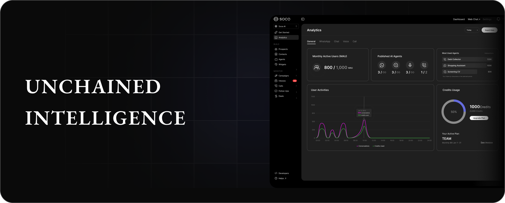

## Resources

<CardGroup cols={2}>
  <Card title="Get Inspiration" color="F50BDB" icon="sparkles" href="https://docs.soca.ai/get_inspiration">
    Explore the possibilities of our AI platform
  </Card>

  <Card title="Studio" color="6D75F6" icon="arrow-progress" href="https://docs.soca.ai/build/studio/conversation_node">
    Build conversational AI agents with no-code workflows
  </Card>

  <Card title="Quickstart Guides" color="FF907E" icon="bolt" href="https://docs.soca.ai/tutorials">
    Get up & running in minutes with one of our quickstart guides
  </Card>

  <Card title="API Reference" color="0EA65E" icon="code" href="https://docs.soca.ai/api-reference/introduction">
    Connect your data or applications to AI programmatically
  </Card>
</CardGroup>