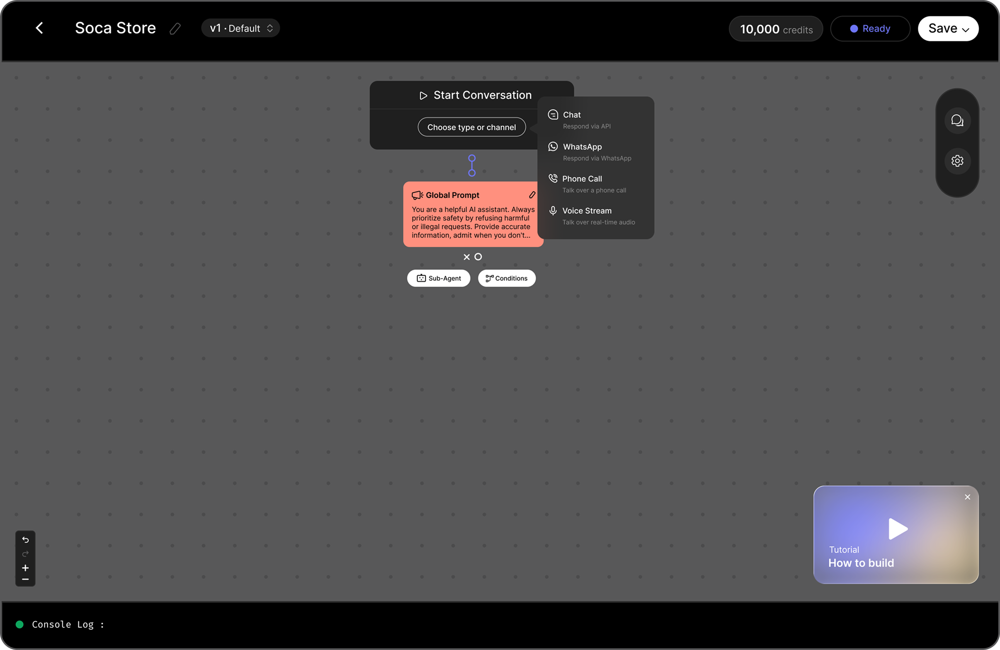

## Home

It all starts here. A powerful no-code AI platform to build endless AI agents that can think, act, and engage—through WhatsApp, chat, and voice stream.

## Studio

Imagine building AI agents with ease. With Studio, you can create dynamic use cases using tools, conditions, webhooks, and more. Automate complex processes and let AI understand your data to take actions autonomously.

One Studio. Every Channel. Build quickly, run effortlessly, and control everything securely—from one powerful workspace.

